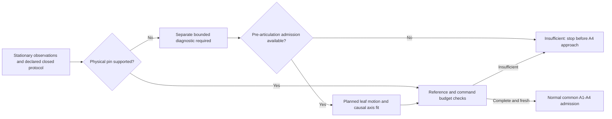

# Shared Pre-A4 Initialization and the Simulated Hinge Budget

Defined on 2026-10-07 from `main @da804ad`. This is a protocol specification and
saved-data command sensitivity audit, not an implemented movement controller.
No robot/leaf motion, contact, new acquisition or policy execution is authorized
by this specification or performed in its evaluation. The retained reference is
**graph off, partial batch on, rollback off, five inliers and 4 mm**, including
[[../experiments/p2p-observed-geometry-and-sdf-jacobian|the observed geometry and vectorized Jacobian]].
A3/A4, their coordinates and their operational admission remain unchanged.

## Shared initialization before choosing the policy

All A1–A4 × ACT/Diffusion conditions receive the same causal initialization
observations and the same declared physical starting state. Use an independent
initialization routine before policy dispatch, with one fixed observation/probe
protocol and budget for every condition. No per-policy privileged fallback,
extra A4-only experience or evaluator-assisted candidate selection is allowed.
Record initialization success/failure, time and any future diagnostic excursion
separately; retain failed starts in end-to-end coverage. Policy execution cannot
hide its initialization cost. A representation ablation holds the physical
experience, sensors, ownership evidence and admission envelope common even where
a primitive conversion uses fewer geometric fields.

The proposed state sequence is `stationary_observation → direct_axis_evidence`
or `diagnostic_required → independently_admitted_probe → axis_evidence`, then
`reference_ready` or `insufficient`. These states are a design contract, not new
executable states. Only `reference_ready` may precede normal A4 approach admission.
It requires a supported physical hinge, the frozen observed closed convention,
the correctly timed current angle, resolved material identity, selected finite
contact geometry and command-relevant uncertainty. It does not itself admit load.

The following is the planned shared initialization flow:

At stationary observation, synchronized metric RGB-D, intrinsics, camera FK,
proprioception and timestamps can support a local surface, normal, observed
extent/patch and the static reference rotation. Freeze `R_WD=[x,y,z]`: `z` is
calibrated world up, `x` is the measured closed normal projected horizontally,
and `y=z cross x`. Preserve viewing-side/sign conventions. Closed and unlatched
are experimental protocol assertions; do not infer latch state or physical hinge
from a plane, zero angle, an edge, appearance or an asset name. Extents are
observed extents, not hidden whole-leaf dimensions. Camera-only viewpoint changes
can reveal an exposed hinge; they cannot identify an entirely hidden pivot of a
stationary rigid plane.

| Route | Required information | Completion criterion | Insufficient evidence |
|---|---|---|---|
| Direct observation of pin/knuckles | Metric observations of physical hinge structure, multiple points along its axis, adequate axial separation and views to distinguish it from seams; association with the selected leaf and fixed support; calibrated camera/up/floor and fit uncertainty | Consistent physical-axis support, floor intersection/closed orientation and a command-relevant finite bound; competing explanations retained or resolved using measured evidence | Keep explicit unsupported alternatives; request a declared additional view within the observation budget, or report `diagnostic_required`/`insufficient`. Do not promote a panel edge to a pivot |
| Short preliminary leaf-motion diagnostic | The same stationary seed and immutable closed reference; causal rigid-leaf correspondences, camera-motion compensation and sampled angular/positional bounds; a separately admitted means of producing/observing leaf motion | At least three informative samples above `max(5 degrees, 2 × combined angular envelope)`, at least two-thirds vertical consensus, common-pivot residual compatibility and finite propagated bounds; independent current-angle support and material identity | Stop at the declared excursion/time/visibility/uncertainty budget; report why no usable axis exists. Retain all samples and failures; never extend the probe just to obtain a fit |

The current saved stationary scans contain no supported physical pin axis;
`panel_edge_is_not_physical_axis` alternatives have no support. Direct-pin
observation is a valid route in principle, not an available estimator or a
validated observation in these two recordings. A pin fit must quantify direction,
origin, visible-span and floor-intersection uncertainty; vertical direction cannot
be claimed as visually estimated when imposed by the protocol.

For a future perception-first diagnostic, 6–8 degrees is a bounded candidate
observation range, not a validated command or guaranteed fit. The preserved new
fits first appear at 40.4833/39.9667 s, approximately nine seconds after the seed;
these are ordinary opening trajectories, not short-probe validation. Require
independent supported observations within the range; three adjacent correlated
frames cannot be called three independent confirmations. Fit completion is not
just a numerical pivot or an angular excursion. Check agreement on a later causal
observation within the same budget, preserving the shared initial-frame bias.

External/fixture-induced leaf motion can isolate perception from robot contact.
Robot-induced diagnosis needs an explicit axis-free Cartesian pre-articulation
admission path with observed leaf ownership, reachable finite contact support,
continuous robot/tool/possible-leaf sweeps, bounded response/compliance,
robot-only feedback/load and stopping evidence. Existing validators require a
hinge even for A2; do not weaken them, fabricate an axis or encode a guessed A4 arc.
That path is not implemented or qualified. If it cannot be admitted, initialization
ends `insufficient` before any robot contact.

The canonical benchmark starts closed. A future diagnostic must either safely
restore and reobserve that common state under a separately validated restoration
procedure, retaining the original closed frame, or explicitly define a new common
post-diagnostic starting state for all representations and policies. The latter
would be a benchmark protocol change, not a silent relabeling of the final angle
as zero. Restoration is not assumed safe or executed here. Current angle keeps
its own acquisition/support/availability times; static reference evidence never
refreshes dynamic angle or material support. Native return alone does not prove
original-material reacquisition.

## What is missing versus conservative in the current simulation

The complete position bound returned by `fit_motion_axis` is absent because its
interface lacks a supplied calibration/FK budget and, in these calls, floor bound.
That is an incomplete diagnostic contract. It is not evidence that this simulator
has an unknown physical floor or an uncalibrated camera.

| Contribution | Current evidence and interpretation |
|---|---|
| Camera intrinsics/mount/FK | Authored metric intrinsics and constant mount/URDF chain; observations store FK, not door truth. Recomputing all 5,716 opening camera transforms from recorded joints gives exactly the stored transforms. Recorder comparison against rendered camera has maximum 0.0003275 mm translation and 0.0000636 degrees rotation in each complete episode. This is measured simulation implementation agreement, not a hardware calibration bound |
| Floor/up/vertical model | Setup explicitly places floor Z at 0 and uses a vertical revolute model. Treat floor/up as known conditional simulation inputs, with numerical conversion error documented; do not add an unmeasured hardware floor penalty to this model. Vertical direction is a prior. Tilt or an incorrect floor on hardware needs measurement/model rejection |
| Depth and initial surface | Renderer supplies metric distance-to-image-plane; capture copies it without a stereo-noise model. The 4 mm plane tolerance is a chosen conservative geometric allowance, not measured depth standard deviation. Initial position uses that allowance plus plane residual; angular envelope uses the measured span. Sampling/mesh/raster errors still exist |
| Current registration | Maximum measured inlier residual plus 4 mm, with angular uncertainty scaled by correspondence spread. This conditional envelope assumes correct rigid membership. Five internally compatible pairs do not certify leaf identity or bound an incorrect correspondence association |
| Hinge fit and shared bias | Initial-reference error is propagated once as a shared contribution, not averaged down over frames. Angular error and vertical projection discrepancy act at the measured correspondence centroid-to-pivot lever. Weighted inversion, absolute-component envelope propagation and `B0/(1-beta)` feedback are conservative; small opening angles amplify the envelope despite condition number approximately one |
| Freshness, motion/contact/robot | Acquisition timestamps and numerical angle errors exist; live age/load/response/continuous sweep and stopping evidence do not follow from them. These remain separate operational missing sources. No loaded hardware uncertainty is calibrated |

The preserved complete primary fits have conditional origin bounds **at least
128.62/145.60 mm** (light/nominal), with p95 **1,819.15/1,736.54 mm**. Independently
measured origin errors have p95 **3.23/18.97 mm**, maxima **8.36/27.11 mm**. All
2,289/2,320 finite bounds contain the measured error in these recordings. That
small-sample containment does not calibrate a confidence level or justify replacing
the bound by the observed p95. Numerical envelopes, systematic correspondence
bias, experimental error percentiles and hardware uncertainty are different claims.
Closing floor/FK input accounting alone does not remove this large conditional
correspondence envelope. There is no arbitrary requirement to make this diagnostic
bound smaller than 1 cm; retain the existing qualification gates and state what
command can actually tolerate the propagated uncertainty.

## Propagation through the actual unchanged A4 command kernel

`SegmentMotion.start` measures the current tool in the admitted panel frame.
`SegmentMotion.goal` interpolates toward a fixed predicted `target_panel`, applies
`start_angle + alpha * hinge_delta`, using the hinge frame supplied by the adapter.
The actual `OPERATIONAL_V1` adapter supplies the **frozen admission frame** for
every tick of that segment; current observations validate the still-current
admission and may stop it. The legacy diagnostic caller supplies the current
observed frame. A4 converts the resulting world goal through A3/A2. Primitive A3 free-vector rotation
uses only the frozen reference rotation; its origin is algebraically irrelevant.
This does not eliminate the operational requirement for a supported reference.

For origin errors `e0` at admission and `ek` in the current reference, the origin-only
world-goal error with fixed numerical `target_panel` is
`ek - (1-alpha) Qk Q0^T e0`, where `Q` is the panel rotation. For actual
operational A4, the frame is held throughout the segment and `ek=e0=e`. With that error
`e`, it is `[I-(1-alpha) R_world(alpha*phi)] e`. In a zero-angle approach it is
`alpha*e`, reaching the **full origin error at the endpoint**. A legacy caller updating
the hinge can move the goal while the physical tool/leaf are stationary. In the
operational adapter, disagreement can invalidate admission instead; a new segment
requires a newly supported admission rather than silently changing the trajectory. Rotation,
current angle, local target, FK/control and stale-motion effects are additional.

Only when the endpoint is independently re-expressed from the **same measured
physical anchor** at admission does the origin-only arc effect simplify to
`(I-R_world(phi))e`; for vertical yaw its norm is
`2*abs(sin(phi/2))*norm(e_xy)`. This correlated cancellation does not apply to an
arbitrary policy-predicted fixed panel-local endpoint. No anchoring modification
is made to A4. At 5 degrees the preserved conditional bound alone implies at
least 11.22/12.70 mm uncertainty, p95 158.70/151.49 mm, even in that special
anchored case. Reducing the step without qualifying material/feedback is not an
integration solution.

The ignored `outputs/b1/perception/p2p-selected-registration-01/budget-audit.json`
and its driver verify both formulas against the real unchanged `SegmentMotion`
for approach/push, three interpolation fractions, a translated reference and
explicit correlated endpoint construction (agreement within 1e-14 m). There are
no recorded A4 predictions, admissions or closed-loop trajectories; these are
command-kernel sensitivities, not an executed A4 success/failure score.

## Minimum validation before proceeding

First close the **simulation** contract using declared authored floor/up and the
recorded calibration/FK consistency envelope, without changing the geometry
estimator or borrowing truth at inference. State which remaining envelope assumes
correct correspondence identity and validate that assumption on causal original
references, masks and held-out observations. Use the same missing/failure rows;
do not use error percentiles as online bounds.

Next replay the unchanged command kernel on declared A4 proposals with estimated
geometry, including frozen admitted frames, invalidating observations, new-segment reference updates and fixed local endpoints, and
check the complete propagated target/rotation/finite-footprint/continuous-sweep
and stopping envelope against the actual proposed action margins. Evaluator truth
may score these commands after construction. For the present saved data, kernel
sensitivity is the minimum non-executing check and is complete; operational
proposal/contact inputs are absent, so admission remains unvalidated. The current
1 cm/5-degree quality requirements and 150 ms freshness remain unchanged. A finite
larger bound can be assessed by `admit_action` for a provisional diagnostic only
when all its declared safety margins cover it. Current policy-source admission
rejects provisional geometry, including a hinge bound above its existing 1 cm
qualification gate. Neither rule is relaxed. There is no justification to run a
broad bound-minimization campaign.

Finally validate either a supported stationary pin route or a separately admitted
bounded pre-articulation route before A4 approach. A controlled simulation probe,
when subsequently authorized and fully admitted, should test only that causal
initialization question. Hardware needs its own depth/intrinsic/mount/joint/floor,
axis-model, material/contact, load/response/compliance and stop qualification.
Simulation numerical agreement cannot supply those bounds.
